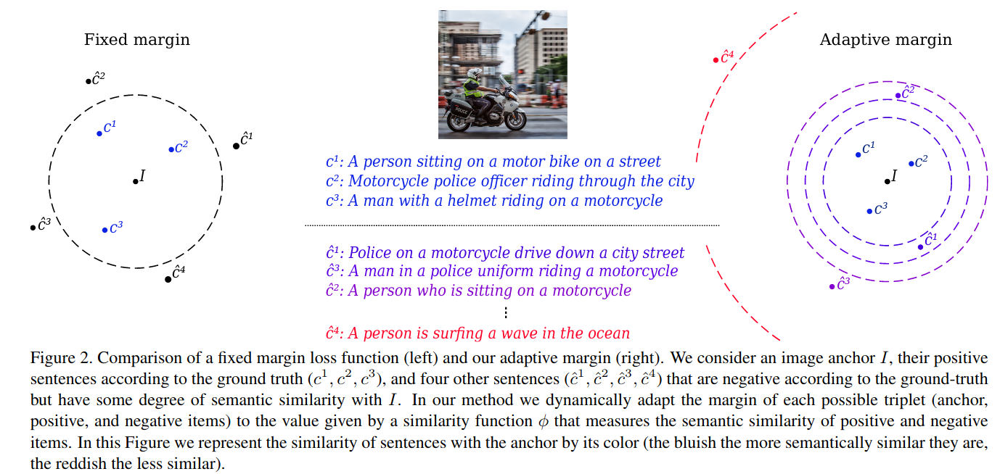

# Is An Image Worth Five Sentences? A New Look into Semantics for Image-Text Matching

Code based on our WACV 2022 Accepted Paper: https://arxiv.org/pdf/2110.02623.pdf

Project is built on top of the [CVSE] (https://github.com/BruceW91/CVSE) in PyTorch. However, it is easy to adapt to different Image-Text Matching models (SCAN, VSRN, SGRAF). Regarding the proposed metric code and evaluation, please visit:  https://github.com/furkanbiten/ncs_metric.

## Introduction
The task of image-text matching aims to map representations from different modalities into a common joint visual-textual embedding. However, the most widely used datasets for this task, MSCOCO and Flickr30K, are actually image captioning datasets that offer a very limited set of relationships between images and sentences in their ground-truth annotations.
This limited ground truth information forces us to use evaluation metrics based on binary relevance: given a sentence query we consider only one image as relevant. However, many other relevant images or captions may be present in the dataset.
In this work, we propose two metrics that evaluate the degree of semantic relevance of retrieved items, independently of their annotated binary relevance.
Additionally, we incorporate a novel strategy that uses an image captioning metric, CIDEr, to define a Semantic Adaptive Margin (SAM) to be optimized in a standard triplet loss. By incorporating our formulation to existing models, a large improvement is obtained in scenarios where available training data is limited. We also demonstrate that the performance on the annotated image-caption pairs is maintained while improving on other non-annotated relevant items when employing the full training set. The code for our new metric can be found at https://github.com/furkanbiten/ncs_metric and model https://github.com/andrespmd/semantic_adaptive_margin

## Install Environment

Git clone the project.

Create Conda environment:

    $ conda env create -f environment.yml

Activate the environment:

    $ conda activate scan
